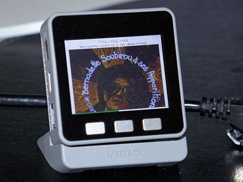

#M5Spot

A Spotify client for M5Stack

- Display song title, artists & JPEG album art
- Display song title, artists & JPEG album art
- Play/Pause, Next, Previous with M5Stack buttons
- Easy OAuth2 authorization through browser
- SSE console in browser to look under the hood

###Prerequisite
- Create an App in [Spotify Developper Dashboard](https://developer.spotify.com/dashboard/) and declare
  http://m5spot.local/callback/ as the Redirect URI.
 
- Insert a SD card in M5Stack (I don't feel comfortable using internal flash for writing JPEG files again & again).
- Rename `config.h.SAMPLE` to `config.h` and complete the settings.
- Install external libraries (see `platformio.ini`)
- Compile and upload `src`
- Upload `data` to file system

###Caveat

This is a work in progress and there is still a lot to do:
- Better display of title/artists (currently needs sharp eyes, and long strings are truncated)
- Better error handling
- A bit of refactoring/polishing
- Add a tap interface: Play/Pause with a tap, Next with a double tap (thanks to the gray edition with integrated MP9250)
- Eventually add a gesture interface: use hand swipes to Play/Pause/Next/Previous (via external APDS9960)
- Give option to store album art JPEG files in SPIFFS, instead of SD Card 
- Cache last n JPEG files, to avoid unnecessary traffic & memory write when always playing the same songs :)
- Tests, tests, tests...

I decided to realease it anyway, just before my annual AFK period, in case someone would find it interresting enough
to work on it while I'm lazying under the sun. ;)

 